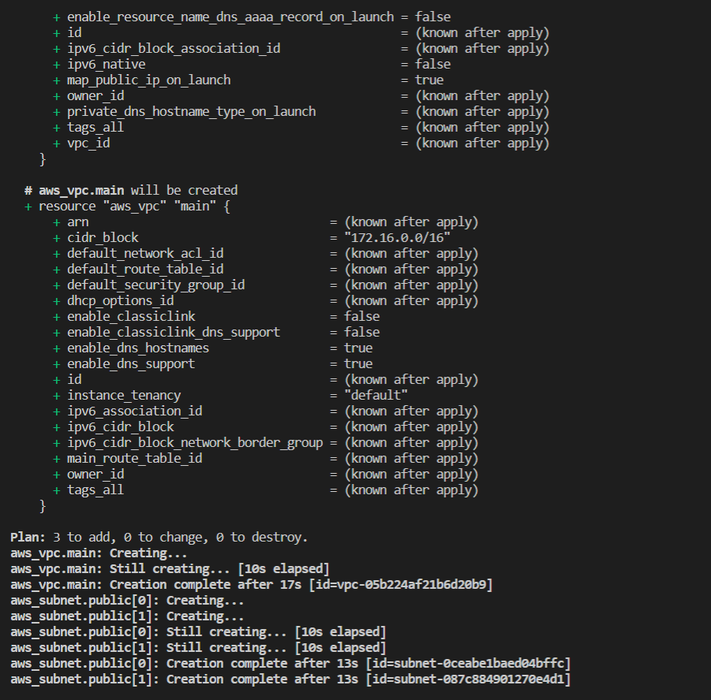

### automating aws cloud infrastructure using terraform

- created an s3 bucket to store infrastructure data

- configured git bash to connect to aws using access key, secret access key and downloading necessary applications and dependencies

- wrote terraform script to create aws vpc in us-east-1 region
- did terraform init to start terraform backend program
- terraform plan to see the plan on creating the vpc

- added additional scripts to create 2 public subnets
- formatted, validated and created a plan of the scripts
- ran the apply command to see the end result

- ran the destroy command to generate better scripts for the infrastructure automation

- created scripts that included variables to quicken the build process
- added a null to test the build response to the subnet specification. the response was as imagined - it returned a plan to build 6 subnets as was designed in the script

- added final tweaks to the scripts\
- separated them into various files
- ran the final command

